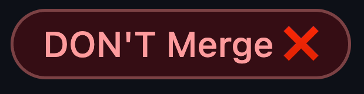
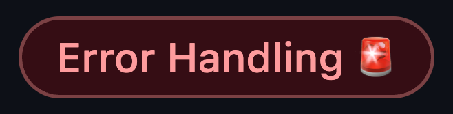
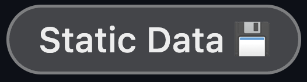

<h1 align="center">
  <br>
  
  <br>
  GitHub Labels
  <br>
</h1>

<h2 align="center">Make your GitHub README stand out with a collection of technology badges.</h2>

## Common Badges


```markdown

```

```markdown

```

```markdown

```


```markdown

```

```markdown

```

```markdown

```

## FrontEnd Badges


```markdown

```

```markdown

```

```markdown

```

```markdown

```

```markdown

```


```markdown

```

```markdown

```

```markdown

```

```markdown

```

```markdown

```

```markdown

```


```markdown

```

```markdown

```

```markdown

```

```markdown

```


```markdown

```

```markdown

```

```markdown

```

## Backend Badges


```markdown

```

```markdown

```

```markdown

```

```markdown

```

```markdown

```

```markdown

```

```markdown

```

```markdown

```

## Mobile Badges


```markdown

```

```markdown

```

```markdown

```

```markdown

```

```markdown

```

```markdown

```

## Testing and CI/CD Badges


```markdown

```

```markdown

```

```markdown

```

```markdown

```

```markdown

```

## Tools Badges


```markdown

```

```markdown

```

```markdown

```

```markdown

```

```markdown

```

```markdown

```

```markdown

```

## [Table of Contents](#table-of-contents)

- [Shared Labels](#shared-labels)
- [Frontend Labels](#frontend-labels)
- Backend Labels (coming soon)

## [Shared Labels](#shared-labels)

<table>
 <tr>
  <th>Label</th>
  <th>Description</th>
  <th>Color</th>
  <th>Preview</th>
 </tr>
 <tr data-type="row">
  <td data-type="label">
  
```
Bug 🐞
```

  </td>
  <td data-type="desc">

```
Something isn't working
```

  </td>
  <td data-type="color">

```
#d73a4a
```

  </td>
  <td data-type="preview" width="200">


  </td>
 </tr>
 <tr data-type="row">
  <td data-type="label">

```
fix 🛠️
```

  </td>
  <td  data-type="desc">

```
bug fixes
```

  </td>
  <td data-type="color">

```
#0E8A16
```

  </td>
  <td data-type="preview" width="200">


  </td>
 </tr>
  <tr data-type="row">
  <td data-type="label">

```
DON'T Merge ❌
```

  </td>
  <td  data-type="desc">

```
there is a better approach
```

  </td>
  <td data-type="color">

```
#B60205
```

  </td>
  <td data-type="preview" width="200">


  </td>
 </tr>
 <tr data-type="row">
  <td data-type="label">

```
assets 📦
```

  </td>
  <td  data-type="desc">

```
assets related changes
```

  </td>
  <td data-type="color">

```
#FFE5CF
```

  </td>
  <td data-type="preview" width="200">


  </td>
 </tr>

 <tr data-type="row">
  <td data-type="label">

```
Refactor 🟡
```

  </td>
  <td  data-type="desc">

```
any Refactor related PRs
```

  </td>
  <td data-type="color">

```
#FBCA04
```

  </td>
  <td data-type="preview" width="200">


  </td>
 </tr>
 <tr data-type="row">
  <td data-type="label">

```
workaround 💡
```

  </td>
  <td  data-type="desc">

```
Temporary fix to avoid a known issue
```

  </td>
  <td data-type="color">

```
#FBCA04
```

  </td>
  <td data-type="preview" width="200">


  </td>
 </tr>
 <tr data-type="row">
  <td data-type="label">

```
Validation 🔐
```

  </td>
  <td  data-type="desc">

```
any Validation related changes
```

  </td>
  <td data-type="color">

```
#E480BB
```

  </td>
  <td data-type="preview" width="200">


  </td>
 </tr>
 <tr data-type="row">
  <td data-type="label">

```
documentation 📝
```

  </td>
  <td  data-type="desc">

```
add/improve the documentation
```

  </td>
  <td data-type="color">

```
#0075ca
```

  </td>
  <td data-type="preview" width="200">


  </td>
 </tr>
 <tr data-type="row">
  <td data-type="label">

```
Performance ⚡️
```

  </td>
  <td  data-type="desc">

```
for Improving performance
or slow performance issues
```

  </td>
  <td data-type="color">

```
#F2D6B8
```

  </td>
  <td data-type="preview" width="200">


  </td>
 </tr>
 <tr data-type="row">
  <td data-type="label">

```
Testing 🧪
```

  </td>
  <td  data-type="desc">

```
add remove update testing
```

  </td>
  <td data-type="color">

```
#61E98A
```

  </td>
  <td data-type="preview" width="200">


  </td>
 </tr>
 <tr data-type="row">
  <td data-type="label">

```
Setup Tools 🛠️
```

  </td>
  <td  data-type="desc">

```
for Changes related to setup tools
```

  </td>
  <td data-type="color">

```
#FBCA04
```

  </td>
  <td data-type="preview" width="200">


  </td>
 </tr>
 <tr data-type="row">
  <td data-type="label">

```
Release 🎉
```

  </td>
  <td  data-type="desc">

```
for Release related changes
```

  </td>
  <td data-type="color">

```
#0E8A16
```

  </td>
  <td data-type="preview" width="200">


  </td>
 </tr>
 <tr data-type="row">
  <td data-type="label">

```
upgrade packages ⬆️
```

  </td>
  <td  data-type="desc">

```
Upgrading dependencies.
```

  </td>
  <td data-type="color">

```
#BFD4F2
```

  </td>
  <td data-type="preview" width="200">


  </td>
 </tr>
 <tr data-type="row">
  <td data-type="label">

```
HIGH Priority 🚩
```

  </td>
  <td  data-type="desc">

```
any critical BUG Issues
```

  </td>
  <td data-type="color">

```
#B60205
```

  </td>
  <td data-type="preview" width="200">


  </td>
 </tr>
 <tr data-type="row">
  <td data-type="label">

```
New Behavior 🆕
```

  </td>
  <td  data-type="desc">

```
any change in component
or function Behavior
```

  </td>
  <td data-type="color">

```
#006B75
```

  </td>
  <td data-type="preview" width="200">


  </td>
 </tr>
 <tr data-type="row">
  <td data-type="label">

```
New Feature ✨
```

  </td>
  <td  data-type="desc">

```
Whenever a new Feature is created
```

  </td>
  <td data-type="color">

```
#78500E
```

  </td>
  <td data-type="preview" width="200">


  </td>
 </tr>
 <tr data-type="row">
  <td data-type="label">

```
API changes  📡
```

  </td>
  <td  data-type="desc">

```
any HTTP related change
```

  </td>
  <td data-type="color">

```
#D93F0B
```

  </td>
  <td data-type="preview" width="200">


  </td>
 </tr>
 <tr data-type="row">
  <td data-type="label">

```
Auth 🔑
```

  </td>
  <td  data-type="desc">

```
any Authentication related changes
```

  </td>
  <td data-type="color">

```
#ECD414
```

  </td>
  <td data-type="preview" width="200">


  </td>
 </tr>
 <tr data-type="row">
  <td data-type="label">

```
Error Handling 🚨
```

  </td>
  <td  data-type="desc">

```
any Error Handling related changes.
```

  </td>
  <td data-type="color">

```
#FFD9E5
```

  </td>
  <td data-type="preview" width="200">


  </td>
 </tr>
 <tr data-type="row">
  <td data-type="label">

```
Static Data 💾
```

  </td>
  <td  data-type="desc">

```
any static data change.
```

  </td>
  <td data-type="color">

```
#eee
```

  </td>
  <td data-type="preview" width="200">


  </td>
 </tr>

</table>

## [Frontend Labels](#frontend-labels)

[To top](#table-of-contents)

<table>
 <tr>
  <th>Label</th>
  <th>Description</th>
  <th>Color</th>
  <th>Preview</th>
 </tr>
 <tr data-type="row">
  <td data-type="label">
  
```
UI 🎨
```

  </td>
  <td data-type="desc">

```
UI related changes
```

  </td>
  <td data-type="color">

```
#FBCA04
```

  </td>
  <td data-type="preview" width="200">
  

  </td>
 </tr>
 <tr data-type="row">
  <td data-type="label">
  
```
animation 🪄
```

  </td>
  <td data-type="desc">

```
Animation related changes
```

  </td>
  <td data-type="color">

```
#FFD9E5
```

  </td>
  <td data-type="preview" width="200">
  

  </td>
 </tr>
 <tr data-type="row">
  <td data-type="label">
  
```
Store 📦
```

  </td>
  <td data-type="desc">

```
any global state related changes
```

  </td>
  <td data-type="color">

```
#5319e7
```

  </td>
  <td data-type="preview" width="200">
  

  </td>
 </tr>
 <tr data-type="row">
  <td data-type="label">
  
```
Types 📜
```

  </td>
  <td data-type="desc">

```
any Type related changes
```

  </td>
  <td data-type="color">

```
#2b7489
```

  </td>
  <td data-type="preview" width="200">
  

  </td>
 </tr>
</table>
